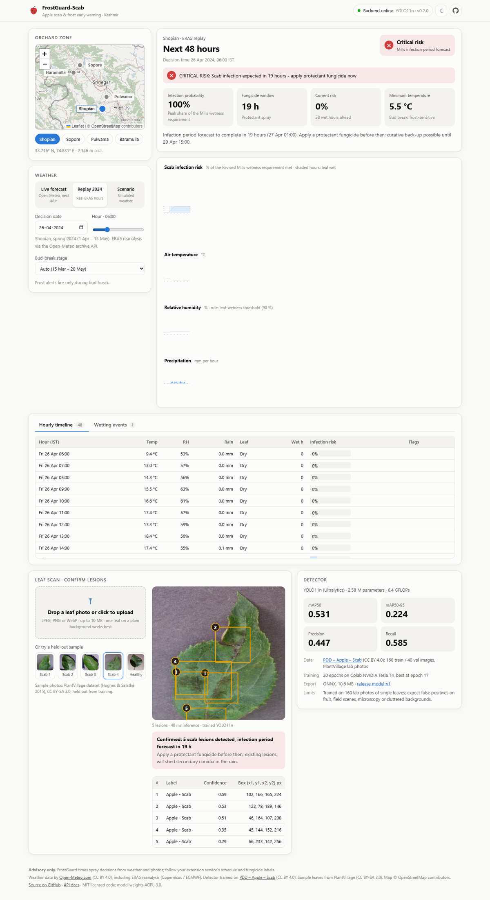
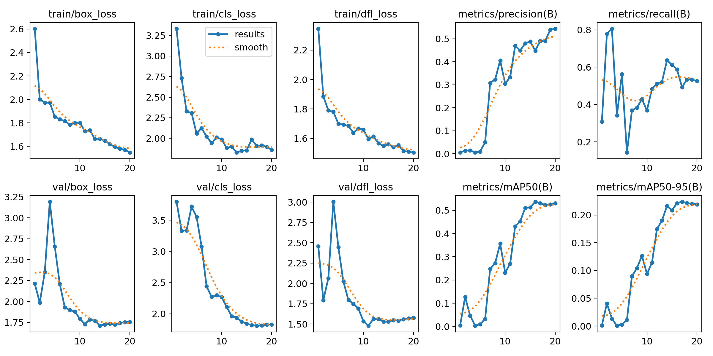
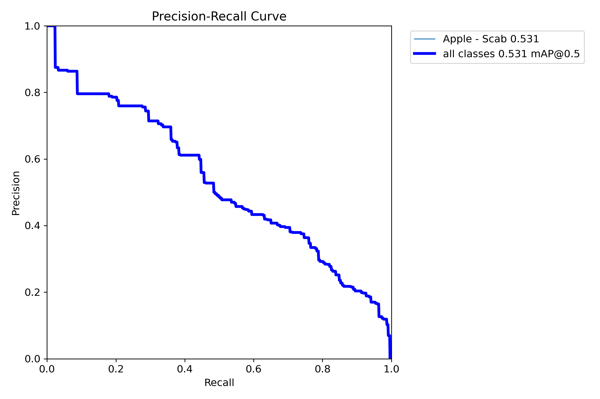
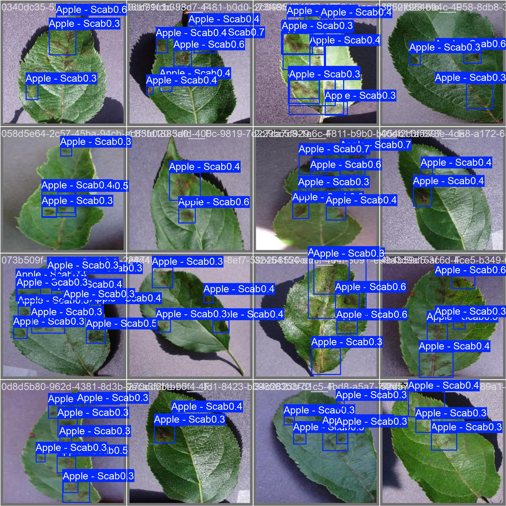
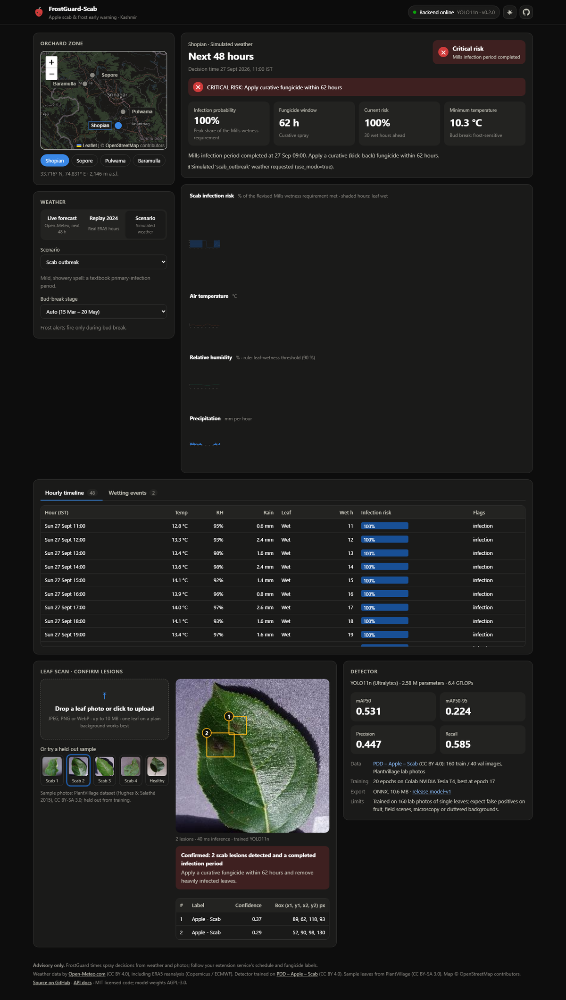
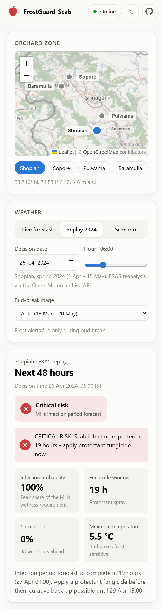

<div align="center">

# 🍎❄️ FrostGuard-Scab

**Physics-informed apple scab & spring-frost early warning for Kashmir's orchards.**<br>
Revised Mills infection periods on live Open-Meteo weather, plus a YOLO11n lesion detector trained on Google Colab and served from a FastAPI backend to a React app.

[](https://peerzadarabet1807.github.io/frostguard-scab/)
[](https://github.com/peerzadarabet1807/frostguard-scab/actions/workflows/ci.yml)
[](https://github.com/peerzadarabet1807/frostguard-scab/releases/tag/model-v1)
[](LICENSE)
<br>
[](https://www.python.org/)
[](https://fastapi.tiangolo.com/)
[](https://onnxruntime.ai/)
[](web/)
[](web/)
[](notebooks/train_yolo_colab.ipynb)
[](docker-compose.yml)
[](#deployment)

<a href="https://colab.research.google.com/github/peerzadarabet1807/frostguard-scab/blob/main/notebooks/train_yolo_colab.ipynb"></a>

<picture>
  <source media="(prefers-color-scheme: dark)" srcset="docs/images/app_dark.png">
  
</picture>

</div>

---

## Contents

- [Why this exists](#why-this-exists-kashmirs-cold-climate-orchards)
- [What it does](#what-it-does)
- [Trained model results](#trained-model-results)
- [The physics: Revised Mills infection periods](#the-physics-revised-mills-infection-periods)
- [Architecture](#architecture)
- [Screenshots](#screenshots)
- [Quickstart](#quickstart)
- [Deployment](#deployment)
- [Retrain the detector on Google Colab](#retrain-the-detector-on-google-colab)
- [REST API](#rest-api)
- [Benchmarks](#benchmarks)
- [Testing & CI](#testing--ci)
- [Configuration](#configuration)
- [Project structure](#project-structure)
- [Limitations & roadmap](#limitations--roadmap)
- [Credits & licences](#credits--licences)

---

## Why this exists: Kashmir's cold-climate orchards

The Kashmir valley grows roughly three-quarters of India's apples, and orchard districts such as **Shopian,
Sopore, Pulwama and Baramulla** sit at 1,500–2,200 m. Their spring is exactly the weather that apple scab
(*Venturia inaequalis*), the valley's most destructive apple disease, needs:

- **Cool, wet springs.** Western disturbances bring repeated rain from March to May at 6–15 °C, where a leaf
  needs only 7–14 hours of continuous wetness for ascospores to infect.
- **Late frosts at bud break.** Clear nights after a cold front can drop below −2 °C just as green tissue and
  blossoms emerge.
- **Calendar spraying.** Fixed spray schedules waste fungicide in dry spells and miss the short curative window
  after a real infection.

FrostGuard turns hourly weather into **infection-period timing**, for example "an infection completes in 19 h,
apply a protectant now" or "infection completed; 62 h left for a curative spray". It adds **frost alerts** and
**photo-based lesion confirmation** on top. Replayed on real ERA5 weather for Shopian in spring 2024, the engine
flags **six Mills infection periods** between 1 April and 15 May.

## What it does

| | Capability | Where |
|---|---|---|
| 🌦️ | Hourly weather from **Open-Meteo** (forecast + ERA5 archive), with cache, retries and a deterministic **offline** fallback | [`src/engine/weather_fetcher.py`](src/engine/weather_fetcher.py) |
| 🧮 | **Revised Mills** leaf-wetness state machine: infection-risk ratio, protectant/curative fungicide windows, **frost-at-bud-break** alerts | [`src/engine/mills_physics.py`](src/engine/mills_physics.py) |
| ⏪ | **Historical replay** of real Shopian ERA5 weather (spring 2024) through the same engine | [`src/engine/replay.py`](src/engine/replay.py) |
| 🔬 | **YOLO11n** lesion detector (**trained, mAP50 0.531**) on **ONNX Runtime**: letterbox, decode, class-aware NMS, plus a fallback ONNX graph when the model isn't installed | [`src/vision/detector.py`](src/vision/detector.py) |
| 🎓 | **Google Colab** notebook: Roboflow dataset → YOLO11n fine-tune on a T4 → ONNX; the executed run is committed | [`notebooks/`](notebooks/) · [`runs/`](runs/scab_yolo11n) |
| 🔌 | **FastAPI** backend: risk, lesion detection, model card, replay datasets | [`src/api/app.py`](src/api/app.py) |
| ⚛️ | **React + TypeScript** web app: clickable zone map, synchronised 48 h small multiples, alerts, table view, leaf scan with box overlays, light/dark, mobile | [`web/`](web/) |
| 🚀 | **Deployed**: web app on **GitHub Pages**, API + model on **Render** (free Docker web service), model weights on a **GitHub release** | [`render.yaml`](render.yaml) · [`.github/workflows/`](.github/workflows/) |
| 🐳 | **Docker Compose**: API (`:8000`) + nginx-served web app (`:8080`) | [`docker-compose.yml`](docker-compose.yml) |

## Trained model results

YOLO11n (2.58 M parameters, 6.4 GFLOPs), fine-tuned for 20 epochs on a Colab T4 on
[PDD – Apple – Scab](https://universe.roboflow.com/thesis-okplj/pdd-apple-scab) (PlantVillage leaf photos, CC BY 4.0).
That dataset version ships no validation split, so the notebook held out a reproducible 20 %: 160 train and
40 val images.

| Metric (val, 40 held-out images) | Value |
|---|---:|
| **mAP50** | **0.531** |
| mAP50-95 | 0.224 |
| Precision | 0.447 |
| Recall | 0.585 |

<p align="center">
  <br>
  
  
</p>

- **Model card:** [`models/model_card.json`](models/model_card.json). It pins the ONNX file's SHA-256, and the API
  serves the card at `/api/v1/model` only when that hash matches the loaded model.
- **Weights:** [release `model-v1`](https://github.com/peerzadarabet1807/frostguard-scab/releases/tag/model-v1)
  (`scab_detector.onnx` for serving, `best.pt` for further fine-tuning). Install with
  `python scripts/download_model.py`, which verifies the hash.
- **Full training record:** [`runs/scab_yolo11n/`](runs/scab_yolo11n) (curves, confusion matrix, batches) and the
  executed notebook [`notebooks/train_yolo_colab_executed.ipynb`](notebooks/train_yolo_colab_executed.ipynb).

> **Treat these as honest small-data numbers.** 160 training images and a 40-image validation set give wide
> error bars. The model works on single-leaf lab photos like its training data: the web app's samples are the
> actual held-out validation leaves. On apple *fruit*, field scenes or microscopy images it produces confident
> false positives. More (and field-collected) data is the top roadmap item.

## The physics: Revised Mills infection periods

Primary scab infections happen when ascospores land on a leaf that **stays wet long enough at a given
temperature**. FrostGuard implements the Revised Mills criteria (Mills 1944, as revised by
MacHardy & Gadoury 1989) as an hourly state machine.

**1. Leaf wetness.** An hour is wet when

$$\text{RH} \ge 90\% \quad \lor \quad P > 0.1\ \text{mm}$$

**2. Wetness requirement $H(T)$.** Hours of continuous wetness needed for infection:

| Mean temperature $T$ | Required wet hours $H(T)$ |
|---|---:|
| $4 \le T \le 6$ °C | 28 |
| $6 < T \le 8$ °C | 14 |
| $8 < T \le 10$ °C | 11 |
| $10 < T \le 12$ °C | 9 |
| $12 < T \le 15$ °C | 7 |
| $15 < T \le 24$ °C | 6 |
| outside 4–24 °C | no progress |

**3. Infection-risk ratio.** Each wet hour contributes the fraction of the requirement it satisfies at its own
temperature:

$$R(t) = \min\Big(1,\ \sum_{\text{wet } h \le t} \frac{1}{H(T_h)}\Big)$$

At constant temperature this equals the classic `wet_hours / H(T)`, and it stays consistent when temperature
drifts across bands. **$R = 1$ marks a completed infection period.**
Levels: LOW < 0.3 ≤ MODERATE < 0.7 ≤ HIGH < 1.0 ≤ CRITICAL.

**4. Dry-period reset.** Short dry breaks pause the clock; **8 consecutive dry hours** end the wetting event and
reset $R$ to 0.

**5. Fungicide windows.**
- *Protectant:* an infection is forecast to complete in N hours, so spray before then.
- *Curative ("kick-back"):* post-infection fungicides act for about **72 h from the start of the wetting event**;
  FrostGuard reports the hours left.

**6. Frost.** During the bud-break window (15 Mar – 20 May by default; override per request), any hour **below
−2.0 °C** raises a frost-injury alert.

Every threshold is a field of [`EngineConfig`](src/engine/mills_physics.py) and is pinned by tests in
[`tests/test_mills.py`](tests/test_mills.py).

## Architecture

```text
 ┌──────────────── Google Colab (T4) ─────────────────┐        ┌──────── GitHub ────────┐
 │ notebooks/train_yolo_colab.ipynb                   │        │ release model-v1       │
 │ Roboflow ─▶ YOLO11n fine-tune ─▶ ONNX export ──────┼──────▶ │  scab_detector.onnx    │
 └────────────────────────────────────────────────────┘        │  (SHA-256 pinned)      │
                                                                └───────────┬────────────┘
                                                                            │ downloaded at image build
 ┌────────── GitHub Pages ───────────┐   HTTPS / JSON   ┌──────────────────▼─── Render (free Docker web) ──┐
 │ web/  React 19 + TypeScript       │ ───────────────▶ │ Dockerfile: FastAPI + ONNX Runtime (CPU)        │
 │  zone map · 48 h charts · alerts  │                  │  /api/v1/predict-risk ─▶ engine/mills_physics   │
 │  leaf upload + box overlay        │ ◀─────────────── │  /api/v1/detect-lesion ─▶ vision/detector       │
 │  (VITE_API_URL → Render URL)      │                  │  /api/v1/model · /datasets · /scenarios · /docs │
 └───────────────────────────────────┘                  └───────────────────┬─────────────────────────────┘
                                                                            │ hourly forecast / ERA5
                                                                     Open-Meteo API
```

Locally, the same two pieces run with `docker compose up` (web on `:8080`, API on `:8000`) or as dev servers.

## Screenshots

| Desktop, dark: simulated outbreak + curative window | Phone: replay of 26 Apr 2024 |
|---|---|
|  |  |

The light-theme desktop view is at the top of this page. Every chart has a synchronised hover crosshair and a
table view, and colour is never the only signal: levels carry an icon and a label.

## Quickstart

**Backend (Python 3.11+):**

```bash
git clone https://github.com/peerzadarabet1807/frostguard-scab.git && cd frostguard-scab
python -m venv .venv && source .venv/bin/activate      # Windows: .venv\Scripts\activate
pip install -r requirements-runtime.txt                  # slim; requirements.txt = full dev + training stack
python scripts/download_model.py                         # trained YOLO11n from the model-v1 release
uvicorn src.api.app:app --reload                         # http://localhost:8000/docs
```

**Web app (Node 20+):**

```bash
cd web
npm ci
npm run dev                                              # http://localhost:5173 (talks to localhost:8000)
```

**Docker:**

```bash
docker compose up --build                                # web http://localhost:8080 · API http://localhost:8000/docs
```

The API image downloads and verifies the release model at build time. Set `FROSTGUARD_OFFLINE=1` to run fully
air-gapped on simulated weather.

## Deployment

| Piece | Where | How it gets there |
|---|---|---|
| Web app | GitHub Pages: **https://peerzadarabet1807.github.io/frostguard-scab/** | [`pages.yml`](.github/workflows/pages.yml) builds `web/` with `VITE_API_URL` = the repository variable `FROSTGUARD_API_URL` on every push to `web/**` |
| API + model | Render free web service (Docker, Singapore): **https://frostguard-scab-api.onrender.com** ([docs](https://frostguard-scab-api.onrender.com/docs)) | [`render.yaml`](render.yaml) Blueprint; Render redeploys on pushes to `main` once CI passes |
| Model weights | GitHub release [`model-v1`](https://github.com/peerzadarabet1807/frostguard-scab/releases/tag/model-v1) | Downloaded and SHA-256-verified while the API image builds |

**Deploy your own copy of the API:**

[](https://render.com/deploy?repo=https://github.com/peerzadarabet1807/frostguard-scab)

Then point the web app at it and publish:

```bash
gh variable set FROSTGUARD_API_URL --body https://<your-service>.onrender.com
gh workflow run pages.yml
```

**Free-tier behaviour.** The service has 512 MB of RAM and 0.1 CPU, and it sleeps after 15 minutes without
traffic. The first request after that waits for it to wake (about 30–60 s); the web app shows a "waking up the
backend" state and retries meanwhile. Once awake, a leaf scan takes about 1–2 s and a 48 h assessment about 2 s
(measured under the same limits; see [BENCHMARKS.md](BENCHMARKS.md#hosted-latency)).

Anyone can point the web app at another backend with `?api=https://your-host` or through the status pill in the
header. A Hugging Face Docker Space also works (`python scripts/deploy_hf_space.py`), but since 2026 it requires
a Hugging Face PRO account.

## Retrain the detector on Google Colab

<a href="https://colab.research.google.com/github/peerzadarabet1807/frostguard-scab/blob/main/notebooks/train_yolo_colab.ipynb"></a>

1. Open the notebook in Colab and choose **Runtime ▸ Change runtime type ▸ T4 GPU**. Add a Colab secret
   `ROBOFLOW_API_KEY` (free Roboflow account).
2. **Run all.** The notebook downloads the dataset and creates a validation split if the dataset version
   lacks one. It fine-tunes YOLO11n with checkpoints on Drive, evaluates, and exports `scab_detector.onnx` to
   `MyDrive/frostguard-scab/models/`.
3. Copy the model to `models/` and the run folder to `runs/`, then refresh the model card and publish:
   ```bash
   python scripts/build_model_card.py
   gh release create model-v2 models/scab_detector.onnx models/model_card.json --notes "..."
   ```
   Update `RELEASE_TAG` in `scripts/build_model_card.py` first so the card points at the new release.

## REST API

Interactive docs are served at `/docs` on the API.

| Endpoint | Purpose |
|---|---|
| `GET /health` | Liveness, version, active vision backend (`trained` / `fallback`) |
| `GET /api/v1/model` | Loaded detector, classes, input size, and the model card (when its SHA-256 matches) |
| `GET /api/v1/zones` · `/scenarios` · `/datasets` | Orchard zones, simulated weather regimes, replayable historical datasets |
| `POST /api/v1/predict-risk` | `zone` or `latitude`+`longitude` (live), uploaded `weather`, or `replay`+`as_of` → 48 h timeline, infection probability, fungicide window, frost |
| `POST /api/v1/detect-lesion` | Multipart image → lesion boxes (image pixels), label, confidence |

```bash
# Live 48 h risk for a zone (falls back to simulated weather if Open-Meteo is unreachable)
curl -s -X POST localhost:8000/api/v1/predict-risk -H 'Content-Type: application/json' -d '{"zone": "shopian"}'

# Replay a real 2024 infection period
curl -s -X POST localhost:8000/api/v1/predict-risk -H 'Content-Type: application/json' \
     -d '{"replay": "shopian_spring_2024", "as_of": "2024-04-26T06:00:00+05:30"}'

# Detect lesions on a held-out sample leaf
curl -s -X POST localhost:8000/api/v1/detect-lesion -F "file=@data/samples/scab_leaf_4.jpg"
```

## Benchmarks

Measured on an Intel i7-10710U laptop CPU. Full method and tables are in [BENCHMARKS.md](BENCHMARKS.md).

| Metric | Target | Measured |
|---|---|---|
| Risk-engine throughput | > 10,000 h/s | **316k–484k h/s** ✅ |
| Detector footprint | < 12 MB | **10.6 MB** trained ONNX ✅ |
| Detector inference (CPU) | < 15 ms | **59.6 ms @ 640 px** ❌ · 13.5 ms @ 320 px ✅ (options to close the gap are in BENCHMARKS.md) |

## Testing & CI

```bash
pytest -q                           # 175 Python tests (trained-model checks skip until the model is downloaded)
cd web && npm test                  # 19 web tests (Vitest + Testing Library)
cd web && npm run lint && npm run typecheck
```

[CI](.github/workflows/ci.yml) runs on every push and pull request:
- Python 3.11 and 3.12 test suites against the release model (downloaded and hash-verified).
- Web lint, strict type-check, tests and production build.
- Builds of both Docker images, with smoke tests that assert the API serves the trained model and detects
  lesions on a sample leaf.

## Configuration

| Variable | Default | Effect |
|---|---|---|
| `FROSTGUARD_MODEL_PATH` | `models/scab_detector.onnx` | Detector to load (falls back to the heuristic graph if missing) |
| `FROSTGUARD_OFFLINE` | `0` | `1` = never call Open-Meteo; simulated weather |
| `FROSTGUARD_CORS_ORIGINS` | `*` | Comma-separated allowed origins ([`render.yaml`](render.yaml) allows GitHub Pages + localhost) |
| `FROSTGUARD_ORT_THREADS` | auto | Pin ONNX Runtime threads and disable spin-waiting; `1` makes detection ~5× faster on fractional-CPU hosts |
| `FROSTGUARD_CACHE_DIR` | `.cache` | Open-Meteo HTTP cache |
| `FROSTGUARD_MAX_UPLOAD_MB` | `10` | Leaf-photo upload limit |
| `PORT` / `WEB_CONCURRENCY` | `8000` / `1` | API container port and worker count |
| `VITE_API_URL` (build time) | `http://localhost:8000` | Backend the web app calls; overridable at runtime with `?api=` |
| `VITE_BASE` (build time) | `/` | Public path (`/frostguard-scab/` on GitHub Pages) |

## Project structure

```text
frostguard-scab/
├── src/
│   ├── engine/           # weather_fetcher · mills_physics · replay · psychrometrics
│   ├── vision/           # detector (ONNX Runtime) · fallback_model · synthetic test leaves
│   └── api/              # FastAPI app + Pydantic schemas
├── web/                  # React 19 + TypeScript app (Vite, Recharts, Leaflet), Dockerfile + nginx.conf
├── notebooks/            # Colab training notebook (template + executed run)
├── runs/scab_yolo11n/    # training curves, metrics, sample predictions (weights live on the release)
├── models/               # model_card.json · fallback/ graph (trained .onnx is git-ignored, see release)
├── data/                 # Shopian ERA5 spring 2024 · mock scenarios · samples/ (held-out leaves)
├── scripts/              # download_model · build_model_card · benchmark · build_sample_data · deploy_hf_space (alt.)
├── tests/                # pytest suites (engine, weather, vision, API, trained model)
├── .github/workflows/    # ci · pages
├── Dockerfile            # API image (also what Render deploys)
├── render.yaml           # Render Blueprint for the hosted API
└── docker-compose.yml    # API + web
```

## Limitations & roadmap

- **Small, lab-only training data.** Collecting field photos from Kashmir orchards and retraining is the
  highest-value next step; the notebook and release flow are ready for it.
- **Leaf wetness is inferred from RH and rain,** not measured. Planned: a LightGBM calibration layer against
  canopy-wetness sensors (`lightgbm` is already in `requirements.txt`).
- **Primary (ascospore) infections only.** An ascospore-maturity model (e.g. Gadoury–MacHardy degree-days) would
  temper early-season risk.
- **Calendar-based phenology.** Growing-degree-day bud-break per zone is on the roadmap.
- **Grid-scale weather.** Open-Meteo/ERA5 cells are kilometres wide; an on-farm station feed would sharpen both
  the scab and the frost logic.
- **Grower alerts.** Scheduled SMS or WhatsApp alerts in Kashmiri, Urdu or Hindi.
- **Advisory only.** Follow your local extension service's spray schedule and fungicide labels.

## Credits & licences

- **Weather:** [Open-Meteo.com](https://open-meteo.com/) (CC BY 4.0), including ERA5 reanalysis from Copernicus / ECMWF.
- **Training data:** [PDD – Apple – Scab](https://universe.roboflow.com/thesis-okplj/pdd-apple-scab) by *Thesis* on Roboflow Universe (CC BY 4.0).
- **Sample leaves:** PlantVillage dataset (Hughes & Salathé 2015), **CC BY-SA 3.0**, redistributed unmodified; see [`data/samples/ATTRIBUTION.md`](data/samples/ATTRIBUTION.md).
- **Map tiles:** © [OpenStreetMap](https://www.openstreetmap.org/copyright) contributors.
- **Model:** [Ultralytics YOLO11](https://github.com/ultralytics/ultralytics). The trained weights are **AGPL-3.0**.
- **Agronomy:** Mills, W. D. (1944), *Efficient use of sulfur dusts and sprays during rain to control apple scab*,
  Cornell Ext. Bull. 630; MacHardy, W. E. & Gadoury, D. M. (1989), *A revision of Mills's criteria for
  predicting apple scab infection periods*, Phytopathology 79: 304–310.

Source code: [MIT License](LICENSE).
