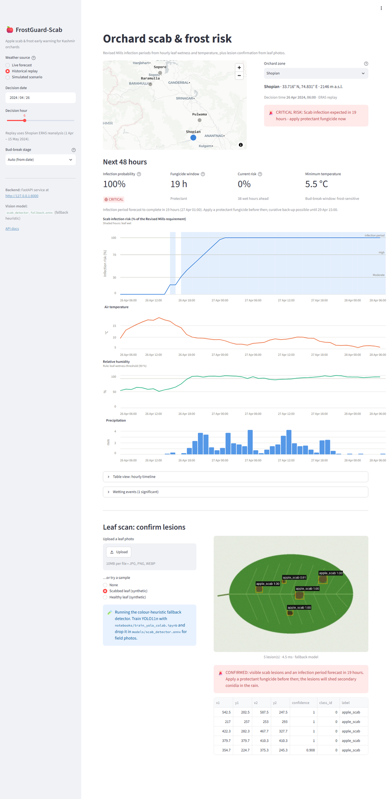

<div align="center">

# 🍎❄️ FrostGuard-Scab

**Physics-informed apple scab & spring-frost early warning for Kashmir's orchards.**<br>
Revised Mills infection-period modelling on live Open-Meteo weather, plus YOLO11n lesion detection served on ONNX Runtime.

[](https://www.python.org/)
[](notebooks/train_yolo_colab.ipynb)
[](https://onnxruntime.ai/)
[](https://fastapi.tiangolo.com/)
[](https://streamlit.io/)
[](docker-compose.yml)
[](LICENSE)
[](https://github.com/peerzadarabet1807/frostguard-scab/actions/workflows/ci.yml)

<a href="https://colab.research.google.com/github/peerzadarabet1807/frostguard-scab/blob/main/notebooks/train_yolo_colab.ipynb"></a>

<picture>
  <source media="(prefers-color-scheme: dark)" srcset="docs/images/dashboard_dark.png">
  
</picture>

</div>

---

## Table of contents

- [Why this exists](#why-this-exists-kashmirs-cold-climate-orchards)
- [What it does](#what-it-does)
- [The physics: Revised Mills infection periods](#the-physics-revised-mills-infection-periods)
- [Architecture](#architecture)
- [Quickstart](#quickstart)
- [Train the detector on Google Colab](#train-the-detector-on-google-colab)
- [REST API](#rest-api)
- [Benchmarks](#benchmarks)
- [Testing](#testing)
- [Configuration](#configuration)
- [Limitations & roadmap](#limitations--roadmap)
- [Credits & licences](#credits--licences)

---

## Why this exists: Kashmir's cold-climate orchards

The Kashmir valley grows roughly three-quarters of India's apples, and orchard districts such as **Shopian,
Sopore, Pulwama and Baramulla** sit at 1,500–2,200 m. Their spring is exactly the weather that apple scab
(*Venturia inaequalis*), the valley's most destructive apple disease, needs:

- **Cool, wet springs.** Western disturbances bring repeated rain from March to May at 6–15 °C. At those
  temperatures a leaf needs only 7–14 hours of continuous wetness for ascospores to infect.
- **Late frosts at bud break.** Clear, radiative nights after a cold front can drop below −2 °C just as green
  tissue and blossoms emerge.
- **Calendar spraying.** Many growers spray on fixed schedules, not in response to infection events. That
  wastes fungicide in dry spells and misses the short curative window after a real infection.

FrostGuard-Scab turns hourly weather into **infection-period timing** ("an infection completes in 19 h, apply
a protectant now" or "an infection completed 6 h ago, 66 h left for a curative spray"). It adds **frost alerts**
and a **leaf-photo lesion check**, all on a CPU-only stack. When the replay is run on real ERA5 weather for
Shopian in spring 2024, the engine flags **six Mills infection periods** between 1 April and 15 May.

## What it does

| | Capability | Where |
|---|---|---|
| 🌦️ | Hourly weather from **Open-Meteo** (forecast + ERA5 archive), with cache, retries and a deterministic **offline mock** fallback | [`src/engine/weather_fetcher.py`](src/engine/weather_fetcher.py) |
| 🧮 | **Revised Mills** leaf-wetness state machine: infection-risk ratio, protectant/curative fungicide windows, **frost-at-bud-break** alerts | [`src/engine/mills_physics.py`](src/engine/mills_physics.py) |
| 🔬 | **YOLO11n** lesion detector on **ONNX Runtime** (letterbox, decode, class-aware NMS), with an auto-generated **fallback ONNX graph** so a fresh clone runs out of the box | [`src/vision/detector.py`](src/vision/detector.py) |
| 🎓 | **Google Colab** notebook: Roboflow dataset → YOLO11n fine-tune on a T4 → ONNX export to Drive | [`notebooks/train_yolo_colab.ipynb`](notebooks/train_yolo_colab.ipynb) |
| 🔌 | **FastAPI** service: `/health`, `/api/v1/predict-risk`, `/api/v1/detect-lesion` | [`src/api/app.py`](src/api/app.py) |
| 📊 | **Streamlit** dashboard: clickable zone map, 48 h risk small multiples, alerts, leaf-scan confirmation | [`demo/app_streamlit.py`](demo/app_streamlit.py) |
| 🐳 | **Docker Compose**: API on `:8000` and dashboard on `:8501`, from one slim image with no PyTorch | [`docker-compose.yml`](docker-compose.yml) |

## The physics: Revised Mills infection periods

Primary scab infections happen when ascospores land on a leaf that **stays wet long enough at a given
temperature**. FrostGuard implements the Revised Mills criteria (Mills 1944, as revised by
MacHardy & Gadoury 1989) as an hourly state machine.

**1. Leaf wetness.** An hour is wet when

$$\text{RH} \ge 90\% \quad \lor \quad P > 0.1\ \text{mm}$$

**2. Wetness requirement $H(T)$.** Hours of continuous wetness needed for infection:

| Mean temperature $T$ | Required wet hours $H(T)$ |
|---|---:|
| $4 \le T \le 6$ °C | 28 |
| $6 < T \le 8$ °C | 14 |
| $8 < T \le 10$ °C | 11 |
| $10 < T \le 12$ °C | 9 |
| $12 < T \le 15$ °C | 7 |
| $15 < T \le 24$ °C | 6 |
| outside 4–24 °C | no progress |

**3. Infection-risk ratio.** Each wet hour contributes the fraction of the requirement it satisfies at its own
temperature:

$$R(t) = \min\Big(1,\ \sum_{\text{wet } h \le t} \frac{1}{H(T_h)}\Big)$$

At constant temperature this is exactly the classic `wet_hours / H(T)`. It also stays consistent when
temperature drifts across bands during a long wetting event. **$R = 1$ marks a completed infection period.**
Levels: LOW < 0.3 ≤ MODERATE < 0.7 ≤ HIGH < 1.0 ≤ CRITICAL.

**4. Dry-period reset.** Short dry breaks pause the clock without progress. **8 consecutive dry hours** end the
wetting event and reset $R$ to 0.

**5. Fungicide windows.**
- *Protectant*: infection forecast to complete in N hours → spray before then.
- *Curative ("kick-back")*: post-infection fungicides act for about **72 h from the start of the wetting event**,
  so FrostGuard reports the hours left in that window.

**6. Frost.** During the bud-break window (15 Mar – 20 May by default; override per request), any hour
**below −2.0 °C** raises a frost-injury alert for green-tip → petal-fall tissue.

Every threshold is a field of [`EngineConfig`](src/engine/mills_physics.py), and each is pinned by a test in
[`tests/test_mills.py`](tests/test_mills.py): band edges, the strict/inclusive boundaries, 7-vs-8 dry-hour
resets, and the curative-window arithmetic.

## Architecture

```text
                      ┌────────────────────── Google Colab (T4 GPU) ──────────────────────┐
                      │ notebooks/train_yolo_colab.ipynb                                   │
                      │  Roboflow "Apple Scab" ─▶ YOLO11n fine-tune ─▶ export ONNX ─▶ Drive │
                      └───────────────────────────────────────┬────────────────────────────┘
                                                              │ scab_detector.onnx (≈10 MB)
                                                              ▼
 Open-Meteo API ──▶ ┌───────────────────────────┐    ┌───────────────────────────────┐
 (forecast/ERA5)    │ engine/weather_fetcher.py │    │ vision/detector.py            │◀── leaf photo
 offline mock ────▶ │ cache · retry · normalise │    │ ONNX Runtime · letterbox · NMS│
                    └─────────────┬─────────────┘    │ models/scab_detector.onnx     │
                                  ▼                  │   └─ else fallback graph      │
                    ┌───────────────────────────┐    └───────────────┬───────────────┘
                    │ engine/mills_physics.py   │                    │
                    │ wetness · Mills R(t) ·    │                    │
                    │ fungicide windows · frost │                    │
                    └─────────────┬─────────────┘                    │
                                  └──────────────┬───────────────────┘
                                                 ▼
                                ┌─────────────────────────────────┐
                                │ api/app.py (FastAPI :8000)      │
                                │ /health · /predict-risk ·       │
                                │ /detect-lesion · /docs          │
                                └────────────────┬────────────────┘
                                                 ▼  HTTP (or in-process fallback)
                                ┌─────────────────────────────────┐
                                │ demo/app_streamlit.py (:8501)   │
                                │ zone map · 48 h risk · alerts · │
                                │ leaf scan                       │
                                └─────────────────────────────────┘
```

```text
frostguard-scab/
├── src/
│   ├── engine/
│   │   ├── weather_fetcher.py   # Open-Meteo client, zones, mock scenarios, normalisation
│   │   ├── mills_physics.py     # FrostScabPhysicsEngine (Revised Mills + frost)
│   │   └── psychrometrics.py    # Magnus dew point <-> relative humidity
│   ├── vision/
│   │   ├── detector.py          # ScabVisionDetector (ONNX Runtime)
│   │   ├── fallback_model.py    # colour-heuristic detector compiled to an ONNX graph
│   │   └── synthetic.py         # procedural test leaves with ground-truth boxes
│   └── api/
│       ├── app.py               # FastAPI application
│       └── schemas.py           # Pydantic request/response models
├── demo/
│   ├── app_streamlit.py         # dashboard
│   └── charts.py                # Altair small multiples + box rendering
├── notebooks/train_yolo_colab.ipynb
├── models/fallback/             # versioned ~80 KB fallback graph (trained model is git-ignored)
├── data/                        # real Shopian ERA5 spring 2024, mock scenarios, sample leaves
├── scripts/                     # build_sample_data.py, benchmark.py
├── tests/                       # 167 pytest tests (engine, weather, vision, API, dashboard)
├── Dockerfile · docker-compose.yml
└── BENCHMARKS.md
```

## Quickstart

### Local (Python 3.11+)

```bash
git clone https://github.com/peerzadarabet1807/frostguard-scab.git
cd frostguard-scab
python -m venv .venv
source .venv/bin/activate            # Windows: .venv\Scripts\activate

pip install -r requirements.txt      # full dev stack (incl. ultralytics/jupyter)
# or: pip install -r requirements-runtime.txt pytest   # lightweight, no PyTorch

uvicorn src.api.app:app --reload     # API  -> http://localhost:8000/docs
streamlit run demo/app_streamlit.py  # UI   -> http://localhost:8501
```

The dashboard also runs on its own: if no API answers at `FROSTGUARD_API_URL`, it mounts the same FastAPI app
in-process.

### Docker

```bash
docker compose up --build
```

| Service | URL |
|---|---|
| Dashboard | http://localhost:8501 |
| API + Swagger docs | http://localhost:8000/docs |

`./models` is mounted read-only into the API container. Drop the Colab-trained `scab_detector.onnx` there and
restart; no rebuild is needed. Set `FROSTGUARD_OFFLINE=1` to run fully air-gapped on simulated weather.

## Train the detector on Google Colab

<a href="https://colab.research.google.com/github/peerzadarabet1807/frostguard-scab/blob/main/notebooks/train_yolo_colab.ipynb"></a>

All GPU work happens in [`notebooks/train_yolo_colab.ipynb`](notebooks/train_yolo_colab.ipynb). The local
machine only ever runs ONNX Runtime.

1. Open the notebook in Colab and choose **Runtime ▸ Change runtime type ▸ T4 GPU**.
2. Add your free Roboflow API key as a Colab secret named **`ROBOFLOW_API_KEY`** (🔑 sidebar). If it's missing,
   the notebook prompts for it.
3. **Run all.** The notebook mounts Drive, installs `ultralytics` + `roboflow`, and downloads the
   [PDD – Apple – Scab](https://universe.roboflow.com/thesis-okplj/pdd-apple-scab) dataset (latest version).
   It fine-tunes `yolo11n.pt` for 20 epochs (15–25 recommended), writing checkpoints to Drive so a disconnect
   is resumable. It then evaluates (mAP, PR curve, confusion matrix, sample predictions) and exports
   **`scab_detector.onnx`** to `MyDrive/frostguard-scab/models/`.
4. Copy the file to **`models/scab_detector.onnx`** and restart the API. `GET /health` should now report
   `"vision_backend": "trained"`.

> **Before the model exists:** the detector builds a tiny ONNX graph that encodes a colour heuristic
> (olive-brown, darker-than-leaf blobs → multi-scale density → peak picking). It has the exact YOLO I/O
> contract, so every code path, from the API to the dashboard's box rendering, works on a fresh clone. It is a
> demo stand-in, not a field-grade model.

## REST API

Interactive docs live at `/docs`. Three examples:

```bash
# 48 h risk for a named zone (live Open-Meteo; falls back to simulated weather if offline)
curl -s -X POST localhost:8000/api/v1/predict-risk \
     -H 'Content-Type: application/json' -d '{"zone": "shopian"}'

# Score your own hourly weather (RH or dew point; precipitation optional)
curl -s -X POST localhost:8000/api/v1/predict-risk -H 'Content-Type: application/json' -d '{
  "weather": [
    {"time": "2024-04-12T00:00:00+05:30", "temperature_2m": 11.2, "relative_humidity_2m": 96, "precipitation": 1.4},
    {"time": "2024-04-12T01:00:00+05:30", "temperature_2m": 10.9, "relative_humidity_2m": 97, "precipitation": 0.8}
  ]}'

# Detect lesions on a leaf photo
curl -s -X POST localhost:8000/api/v1/detect-lesion -F "file=@data/sample_leaf_scab.jpg"
```

<details>
<summary>Example <code>predict-risk</code> response: real ERA5 hours for Shopian, as of 26 Apr 2024 06:00 (truncated)</summary>

```json
{
  "location": {"name": "Shopian", "latitude": 33.716, "longitude": 74.831},
  "weather_source": "uploaded",
  "as_of": "2024-04-26T06:00:00+05:30",
  "infection_probability": 1.0,
  "risk_level": "CRITICAL",
  "fungicide": {
    "action": "protectant",
    "window_hours": 19.0,
    "deadline": "2024-04-27T01:00:00+05:30",
    "message": "Infection period forecast to complete in 19 hours (27 Apr 01:00). Apply a protectant fungicide before then; curative back-up possible until 29 Apr 15:00."
  },
  "frost": {"alert": false, "frost_hours": 0, "min_temperature_c": 5.5, "in_bud_break": true, "threshold_c": -2.0},
  "alerts": ["CRITICAL RISK: Scab infection expected in 19 hours - apply protectant fungicide now"],
  "timeline": [{"time": "2024-04-26T06:00:00+05:30", "temperature_c": 9.45, "relative_humidity": 52.8,
                "precipitation_mm": 0.0, "leaf_wet": false, "wet_hours": 0, "risk_ratio": 0.0,
                "infection": false, "frost_risk": false}]
}
```
</details>

| Endpoint | Purpose |
|---|---|
| `GET /health` | Liveness, version, active vision backend (`trained` / `fallback`) |
| `GET /api/v1/zones` | Kashmir orchard zones (Shopian, Sopore, Pulwama, Baramulla) |
| `POST /api/v1/predict-risk` | `zone` or `latitude`+`longitude` (live), or uploaded `weather` records → 48 h timeline, infection probability, fungicide window, frost |
| `POST /api/v1/detect-lesion` | Multipart image → boxes (image pixels), label, confidence |

## Benchmarks

Measured on an Intel i7-10710U laptop CPU (full methodology in [BENCHMARKS.md](BENCHMARKS.md)):

| Metric | Target | Measured |
|---|---|---|
| Risk-engine throughput | > 10,000 h/s | **484,287 h/s** ✅ |
| Detector footprint | < 12 MB | **10.6–10.7 MB** YOLO11n ONNX ✅ |
| Detector inference (CPU) | < 15 ms | **13.5 ms @ 320 px** ✅ · 48.9 ms @ 640 px ❌ on this 15 W CPU (options to close the gap are in BENCHMARKS.md) |

## Testing

```bash
pytest -q                                    # 166 offline tests, ~25 s
FROSTGUARD_NETWORK_TESTS=1 pytest -m network  # +1 opt-in live Open-Meteo check
```

Test coverage by area:

- **Physics**: every Mills band edge, infection exactly at `H(T)` versus one hour short, cross-band hourly
  summation, 7-vs-8 dry-hour reset, curative/protectant window arithmetic, frost thresholds and phenology, a
  throughput floor.
- **Vision**: letterbox geometry, the YOLO output contract, NMS, both Ultralytics output layouts, fallback
  auto-generation, recall on synthetic leaves.
- **API & UI**: HTTP contracts and validation errors, offline fallback, and headless Streamlit `AppTest` runs
  of every dashboard mode.

## Configuration

| Variable | Default | Effect |
|---|---|---|
| `FROSTGUARD_MODEL_PATH` | `models/scab_detector.onnx` | Detector to load (falls back to the heuristic graph if missing) |
| `FROSTGUARD_OFFLINE` | `0` | `1` = never call Open-Meteo; use simulated weather |
| `FROSTGUARD_API_URL` | `http://localhost:8000` | API the dashboard calls (in-process fallback if unreachable) |
| `FROSTGUARD_PUBLIC_API_URL` | `FROSTGUARD_API_URL` | Browser-facing API URL for the dashboard's docs link |
| `FROSTGUARD_CACHE_DIR` | `.cache` | Open-Meteo HTTP cache |
| `FROSTGUARD_MAX_UPLOAD_MB` | `10` | Leaf-photo upload limit |
| `FROSTGUARD_CORS_ORIGINS` | `*` | Comma-separated CORS origins |

## Limitations & roadmap

Keep these in mind before relying on it in the field:

- **The fallback detector is a heuristic.** Until you train the Colab model, "lesions" means dark olive-brown
  blobs. It will also flag shadows and dark backgrounds.
- **Leaf wetness is inferred from RH/rain,** not measured. Canopy wetness sensors are the gold standard.
  Planned: a LightGBM calibration layer (the dependency is already in `requirements.txt`) that learns
  sensor-measured wetness from RH, dew-point depression, wind and radiation.
- **Primary (ascospore) infections only.** There is no ascospore-maturity model yet (e.g. a Gadoury–MacHardy
  degree-day model), so early-season risk may be overstated before spores mature.
- **Phenology is calendar-based.** The bud-break window is a date range. Growing-degree-day phenology per zone
  is on the roadmap.
- **Grid-scale weather.** Open-Meteo/ERA5 cells are kilometres wide, and valley-floor versus hillside orchards
  differ. An on-farm weather station feed would sharpen both the scab and the frost logic.
- **Advisory only.** Follow your local extension service's spray schedule and fungicide labels. This tool
  times decisions; it does not prescribe products.

## Credits & licences

- **Weather data** by [Open-Meteo.com](https://open-meteo.com/) (CC BY 4.0), including ERA5 reanalysis from
  Copernicus / ECMWF.
- **Dataset**: [PDD – Apple – Scab](https://universe.roboflow.com/thesis-okplj/pdd-apple-scab) by *Thesis* on
  Roboflow Universe (CC BY 4.0).
- **Model architecture**: [Ultralytics YOLO11](https://github.com/ultralytics/ultralytics). Ultralytics code
  and weights derived from its pretrained checkpoints are licensed **AGPL-3.0** (or an Ultralytics Enterprise
  licence). That licence applies to the model you train, not to this repository's source.
- **Agronomy**: Mills, W. D. (1944), *Efficient use of sulfur dusts and sprays during rain to control apple
  scab*, Cornell Ext. Bull. 630; MacHardy, W. E. & Gadoury, D. M. (1989), *A revision of Mills's criteria for
  predicting apple scab infection periods*, Phytopathology 79: 304–310.

The source code in this repository is released under the [MIT License](LICENSE).
